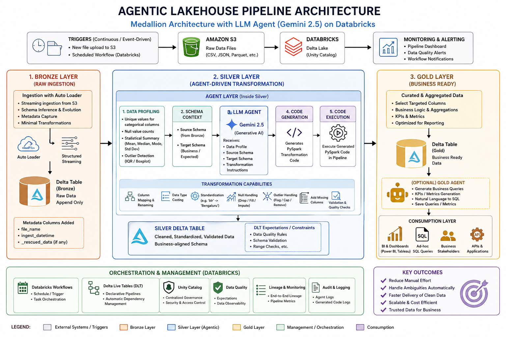

# 🧠 Agentic Lakehouse Pipeline (PySpark + Databricks + LLM)

## 📌 Overview

This project implements an **Intelligent Data Engineering Pipeline** built on the **Medallion Architecture (Bronze → Silver → Gold)** using PySpark and Databricks.

Unlike traditional pipelines, this system integrates a **Large Language Model (LLM) agent (Gemini 2.5)** into the Silver layer to **automatically analyze, clean, and transform raw data** based on schema alignment and data profiling.

The goal is to:

* Reduce manual intervention in ETL pipelines
* Handle ambiguous and inconsistent raw data automatically
* Build **self-adaptive data pipelines** that scale with big data systems

---

## 🏗️ Architecture

```
S3 → Bronze Layer → 🧠 Agent Layer (inside Silver) → Silver Layer → Gold Layer
```



### ⚙️ Key Characteristics

* Event-driven / scheduled execution (Databricks Workflows)
* Continuous ingestion via Auto Loader
* Schema-aware transformations
* LLM-powered automation

---

## 🥉 Bronze Layer (Raw Ingestion)

### Purpose

* Ingest raw data from S3 without heavy transformations
* Preserve original data for traceability

### Features

* Streaming ingestion using Auto Loader
* Metadata tracking (`file_name`, `ingest_datetime`)

---

## 🥈 Silver Layer (Agent-Driven Transformation)

### 🔥 Core Innovation: LLM-Based Agent

The Silver layer integrates an **Agentic Processing Layer** that:

1. **Profiles the data**

   * Unique values for categorical columns
   * Null value counts
   * Statistical summaries (mean, median, mode)
   * Outlier detection (IQR / boxplot logic)

2. **Understands schemas**

   * Source schema (from Bronze)
   * Target schema (business-aligned)

3. **Generates transformation logic**

   * Column mapping (e.g., `prod_name → product_name`)
   * Data type casting
   * Missing column handling
   * Standardization (e.g., `"blr" → "Bengaluru"`)
   * Outlier handling / flagging

4. **Executes generated PySpark code dynamically**

---

### 🧠 Agent Workflow

```
Bronze Data
   ↓
Data Profiling (Spark)
   ↓
Schema Extraction
   ↓
LLM (Gemini 2.5)
   ↓
Generated PySpark Code
   ↓
Execution in Pipeline
   ↓
Validated Silver Table
```

---

## 🥇 Gold Layer (Business-Ready Data)

### Purpose

* Serve clean, structured data for analytics and reporting

### Features

* Aggregations & KPI-ready datasets
* Optimized for BI tools (Power BI, dashboards)

---

### 🚀 Future Extension (Agent in Gold Layer)

Agents can also:

* Compute KPIs automatically
* Translate natural language → SQL

---

## ⚡ Why PySpark & Declarative Pipelines?

### 🔹 PySpark for Big Data

* Distributed processing for large-scale datasets
* Fault-tolerant and scalable
* Native integration with Databricks

---

### 🔹 Declarative Pipelines (DLT Approach)

We use **Spark declarative transformations** instead of imperative logic.

### 🚀 Benefits

#### 1. Automatic Query Optimization

* Spark builds a logical plan (DAG)
* Applies Catalyst Optimizer
* Reorders operations for efficiency

#### 2. Lazy Evaluation

* Execution happens only when needed
* Reduces unnecessary computation

#### 3. Better Performance

* Predicate pushdown
* Column pruning
* Efficient joins

#### 4. Maintainability

* Cleaner, modular code
* Easier debugging and scaling

#### 5. Built-in Dependency Management

* Pipeline execution order handled automatically

---

## 🔄 Orchestration & Execution

### Event-Driven

* New file in S3 → Pipeline triggers automatically

### Scheduled

* Daily / hourly batch runs using Databricks Workflows

---

## 🚀 Future Improvements

* Embedding-based column matching
* Self-healing pipelines (auto error correction)
* Data drift detection
* Human-in-the-loop approval system
* Fully autonomous data pipelines

---

## 🧩 Tech Stack

* **PySpark**
* **Databricks (Delta Live Tables, Workflows)**
* **AWS S3**
* **LLM: Gemini 2.5**
* **Delta Lake**
